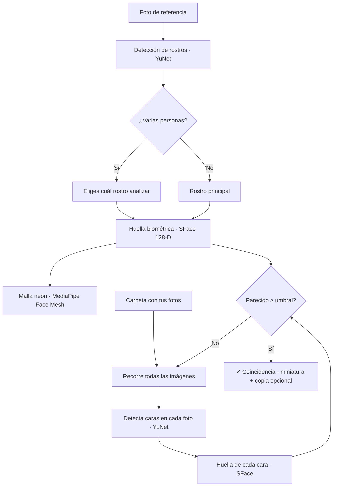

# 🔎 FACE FINDER — Buscador de Personas en Fotos

**Informe técnico y manual de uso completo**
Autor: **KALEVI LATVA AIJO ALEGRIA**
Versión del documento: 1.0 · Plataforma: Windows 11 · Todo el procesamiento es **local y privado**

---

## 1. ¿Qué es y para qué sirve?

**Face Finder** es una aplicación de escritorio que encuentra automáticamente **todas las fotos
en las que aparece una persona concreta** dentro de una carpeta con miles de imágenes.

Le das **una foto de referencia** (la cara de la persona que buscas) y una **carpeta**; el
programa recorre todas las imágenes —incluidas subcarpetas—, reconoce las caras y te muestra
solo aquellas donde aparece esa persona.

Caso de uso típico: *"Tengo miles de fotos y no sé en cuáles salgo con mi amigo."*

- 🔒 **100 % privado:** nada se sube a internet. Todo se procesa en tu computadora.
- 🍎 **Compatible con fotos de iPhone** (HEIC/HEIF/AVIF) además de JPG, PNG, etc.
- 🎨 **Interfaz futurista** con malla biométrica neón sobre el rostro de referencia.
- ⏹ **Cancelable:** puedes detener la búsqueda en cualquier momento.

---

## 2. ¿Cómo funciona? (visión general)



**En palabras sencillas:**

1. El programa **detecta las caras** de la foto de referencia.
2. Convierte la cara elegida en una **"huella" numérica** (un vector de 128 números que
   describe los rasgos únicos de ese rostro).
3. Hace lo mismo con **cada cara de cada foto** de tu carpeta.
4. Compara las huellas: si se parecen lo suficiente, marca esa foto como **coincidencia**.

---

## 3. Modelos de Inteligencia Artificial que usa

El reconocimiento se apoya en **dos redes neuronales** (formato ONNX, de OpenCV Zoo) y **una
malla facial** (MediaPipe). Todos los modelos corren **en la CPU**, sin necesidad de tarjeta
gráfica ni conexión a internet.

| Modelo | Archivo | Tamaño | Función | Detalle técnico |
|--------|---------|:------:|---------|-----------------|
| **YuNet** | `face_detection_yunet_2023mar.onnx` | ~228 KB | **Detectar** rostros | Red neuronal ligera que localiza cada cara y devuelve su recuadro + 5 puntos clave (ojos, nariz, comisuras de la boca) + confianza |
| **SFace** | `face_recognition_sface_2021dec.onnx` | ~37 MB | **Reconocer** rostros | Alinea la cara a 112×112 px y genera un **vector de 128 dimensiones** (la "huella"). Dos caras se comparan por **similitud de coseno** |
| **MediaPipe Face Mesh** | (incluido en `mediapipe`) | — | **Visualizar** (solo estética) | Malla de **478 puntos** que dibuja mandíbula, mentón, cejas/órbita, ojos y boca sobre el rostro de referencia. No interviene en el reconocimiento |

> Los modelos YuNet y SFace son oficiales del proyecto **OpenCV Zoo** (licencia
> permisiva) y están en la carpeta `modelos/`.

---

## 4. Sistema y tecnologías (stack)

| Componente | Tecnología | Versión probada | Para qué |
|-----------|-----------|:---------------:|----------|
| Lenguaje | **Python** | 3.12.7 | Base del programa |
| Interfaz gráfica | **PySide6** (Qt 6) | 6.11.1 | Ventana, estilos neón (QSS), hilos |
| Visión por computador | **OpenCV** (`opencv-python`) | 5.0.0 | Detección (YuNet) y reconocimiento (SFace) |
| Cálculo numérico | **NumPy** | 2.5.1 | Manejo de imágenes como matrices |
| Lectura de imágenes | **Pillow** | 12.3.0 | Abrir imágenes y corregir orientación (EXIF) |
| Fotos de Apple | **pillow-heif** | 1.5.0 | Leer HEIC / HEIF / AVIF (iPhone) |
| Malla facial | **mediapipe** | 0.10.14 | Malla neón de 478 puntos |

- **Sistema operativo:** Windows 11 (probado). El código es portable, pero el lanzador
  `.bat` y `os.startfile` son específicos de Windows.
- **Hardware:** funciona con CPU normal. No requiere GPU.
- **Concurrencia:** la detección, el análisis y la búsqueda corren en **hilos separados
  (`QThread`)**, para que la ventana nunca se congele y la búsqueda se pueda **detener**.

---

## 5. Requisitos previos

- **Windows 10/11**.
- **Python 3.12** instalado (el proyecto usa un entorno propio; ver instalación).
  > Nota: se usa Python **3.12** y no 3.14 porque OpenCV/MediaPipe tienen mejor
  > compatibilidad en 3.12.
- Conexión a internet **solo la primera vez** (para instalar librerías y descargar los
  2 modelos). Después funciona 100 % sin conexión.
- Espacio en disco: ~600 MB (entorno de Python + librerías + modelos).

---

## 6. Instalación paso a paso (desde cero)

### 6.1 Crear el entorno e instalar librerías

Abre una terminal en la carpeta que contiene `Dia-02-Buscador-de-Personas` y ejecuta:

```bash
py -3.12 -m venv .venv_face
.venv_face\Scripts\python -m pip install --upgrade pip
.venv_face\Scripts\python -m pip install opencv-python numpy pillow pillow-heif "mediapipe==0.10.14" PySide6
```

Esto crea el entorno `.venv_face` con todo lo necesario.

### 6.2 Descargar los modelos (si no están)

Deben estar dentro de `Dia-02-Buscador-de-Personas/modelos/`:

- [face_detection_yunet_2023mar.onnx](https://github.com/opencv/opencv_zoo/raw/main/models/face_detection_yunet/face_detection_yunet_2023mar.onnx)
- [face_recognition_sface_2021dec.onnx](https://github.com/opencv/opencv_zoo/raw/main/models/face_recognition_sface/face_recognition_sface_2021dec.onnx)

### 6.3 Ejecutar

Haz **doble clic en `Buscar personas.bat`**.

### 6.4 Instalación rápida (desde una copia de GitHub)

Si descargaste el proyecto desde GitHub, todo es más simple:

1. Doble clic en **`instalar.bat`** → crea el entorno `.venv`, instala las librerías y
   **descarga los 2 modelos** automáticamente.
2. Doble clic en **`Buscar personas.bat`** → abre el programa.

> El lanzador usa primero el entorno local `.venv`; no necesitas configurar nada más.

---

## 7. Cómo usar el programa

La ventana se abre **maximizada** y tiene **dos paneles**:

### Panel izquierdo — Rostro de referencia
1. Pulsa **⬆ Cargar rostro** y elige una foto **clara y de frente** de la persona.
2. Si en la foto hay **varias personas**, aparece un diálogo para que **elijas cuál rostro**
   analizar.
3. Verás la cara elegida con la **malla biométrica neón** (confirma que la detectó bien).

### Panel derecho — Reconocimiento
4. Pulsa **Elegir carpeta** y selecciona dónde están todas tus fotos (revisa subcarpetas).
5. Elige la **precisión**:
   - **Estricta** — menos coincidencias, casi sin errores.
   - **Normal** — equilibrio recomendado.
   - **Amplia** — encuentra más, con más riesgo de falsos positivos.
6. Pulsa **▶ Iniciar reconocimiento**. Las coincidencias van apareciendo abajo como
   **tarjetas que se acomodan por filas** (scroll vertical).
7. **Clic en una tarjeta** abre esa foto. Con **■ Detener** cortas la búsqueda.
8. **↻ Reiniciar** deja todo limpio para un nuevo análisis.

Si dejas marcado *"Copiar a carpeta"*, las coincidencias se copian a una carpeta nueva
`_Encontradas_AAAAMMDD_HHMMSS` dentro de la carpeta revisada (botón **📂 Carpeta**).

---

## 8. Detalles técnicos del reconocimiento

- **Detección (YuNet):** por cada imagen se ajusta el tamaño de entrada, se detectan
  todas las caras y se obtienen recuadro, 5 puntos y confianza (umbral de score 0.8).
- **Alineado + huella (SFace):** cada cara se alinea a 112×112 usando sus puntos y se
  transforma en un **vector de 128 dimensiones** (embedding).
- **Comparación:** se usa **similitud de coseno** entre la huella de referencia y la de
  cada cara encontrada. Umbrales usados:

  | Precisión | Umbral (coseno) |
  |-----------|:---------------:|
  | Estricta  | 0.40 |
  | Normal    | 0.363 *(valor recomendado por OpenCV para SFace)* |
  | Amplia    | 0.30 |

- **Optimización:** las imágenes muy grandes se reducen a 1600 px de lado mayor antes de
  analizar, para acelerar sin perder precisión relevante.
- **Orientación:** se respeta la orientación EXIF (fotos de celular giradas se enderezan).
- **Rendimiento:** el cuello de botella es leer las imágenes del disco; una biblioteca de
  varios miles de fotos puede tardar varios minutos (depende del CPU y del disco).

---

## 9. Privacidad y seguridad

- **Sin nube:** ni las fotos ni las huellas salen de tu equipo. No hay llamadas a internet
  durante el uso.
- **Sin base de datos oculta:** el programa no guarda tu galería en ningún lado; solo copia
  las coincidencias si tú lo pides.
- Los datos biométricos (las huellas de 128 números) se calculan en memoria y se descartan
  al cerrar.

---

## 10. Estructura del proyecto

```
Dia-02-Buscador-de-Personas/
├── buscador_de_personas.py     # Programa principal (interfaz PySide6 + lógica)
├── malla_facial.py             # Malla neón "Jarvis" con MediaPipe (solo visual)
├── Buscar personas.bat         # Lanzador (abre el programa)
├── instalar.bat                # Instalador (crea .venv e instala librerías)
├── crear_exe.bat               # Genera el ejecutable FaceFinder.exe
├── requirements.txt            # Lista de librerías necesarias
├── .gitignore                  # Qué NO subir a GitHub (entornos, cache, resultados)
├── README.md                   # Este documento
├── recursos/
│   └── icono.ico               # Icono de la aplicación
└── modelos/
    ├── face_detection_yunet_2023mar.onnx      # Detector YuNet
    └── face_recognition_sface_2021dec.onnx    # Reconocedor SFace

# NO se sube a GitHub (lo genera cada usuario):
.venv/  ó  .venv_face/          # Entorno de Python con las librerías
```

---

## 11. Crear un ejecutable (.exe) con icono y sin consola

Para tener una app de doble clic (sin `.bat` ni ventana de consola):

1. Instala PyInstaller en el entorno:
   ```bash
   .venv\Scripts\python -m pip install pyinstaller
   ```
2. Ejecuta el script incluido **`crear_exe.bat`** (o el comando de abajo).
3. El ejecutable queda en **`dist\FaceFinder\FaceFinder.exe`**.

Comando equivalente:
```bash
pyinstaller --noconfirm --clean --windowed --onedir --name "FaceFinder" ^
  --icon "recursos\icono.ico" --add-data "modelos;modelos" ^
  --collect-all mediapipe buscador_de_personas.py
```

**Claves para que funcione:**
- `--windowed` → sin ventana de consola.
- `--icon recursos\icono.ico` → icono propio.
- `--add-data "modelos;modelos"` → empaqueta los modelos YuNet y SFace.
- `--collect-all mediapipe` → incluye los datos de la malla facial (imprescindible).
- El programa detecta si corre como `.exe` y busca los modelos dentro del paquete
  (`sys._MEIPASS`).

> Se usa `--onedir` (carpeta `FaceFinder` con el `.exe` dentro): arranca rápido y es más
> estable con OpenCV/MediaPipe/Qt. Para compartirlo, comprime toda la carpeta `FaceFinder`
> en un `.zip`. *(La variante `--onefile` genera un solo archivo pero arranca más lento.)*

---

## 12. Solución de problemas

| Problema | Causa probable | Solución |
|----------|----------------|----------|
| "Faltan los modelos" | No están los `.onnx` | Descárgalos en `modelos/` (sección 6.2) |
| "No detecté ninguna cara" | Foto borrosa o de perfil | Usa una foto nítida y de frente |
| No encuentra fotos donde sí sale | Umbral muy estricto | Cambia la precisión a **Amplia** |
| Encuentra caras de otras personas | Umbral muy amplio | Cambia la precisión a **Estricta** |
| No abre una foto `.heic` | Falta `pillow-heif` | Reinstala librerías (sección 6.1) |
| La ventana se congela | — | No debería: la búsqueda corre en un hilo aparte |

---

## 13. Créditos y licencias

- **Modelos YuNet y SFace:** proyecto [OpenCV Zoo](https://github.com/opencv/opencv_zoo).
- **MediaPipe Face Mesh:** Google MediaPipe.
- **Qt / PySide6:** The Qt Company (licencia LGPL).
- Librerías: OpenCV, NumPy, Pillow, pillow-heif.

---

## 14. Firma

Programa desarrollado y documentado por:

### ✒️ KALEVI LATVA AIJO ALEGRIA

*Face Finder — Buscador de Personas en Fotos · Proyecto local de reconocimiento facial.*
